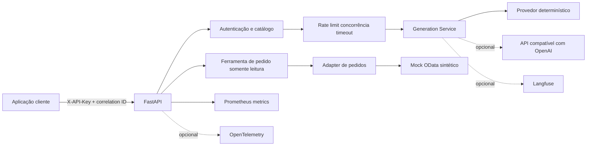

# LLM Operations Lab

Laboratório independente de portfólio para estudar e demonstrar Engenharia de Plataforma de IA, LLMOps, DevOps e observabilidade. O projeto oferece uma API de acesso controlado a modelos de linguagem, executável localmente sem internet, conta externa ou chave paga.

Este repositório não representa um ambiente de produção, empregador ou cliente real. Pedidos, credenciais, modelos e integrações usados na demonstração são fictícios ou simulados.

## O problema

Uma aplicação não deveria chamar modelos de linguagem sem políticas operacionais. Este laboratório coloca uma camada explícita entre cliente e provedor para controlar modelos autorizados, autenticação, volume, concorrência, timeout, retries, telemetria e custo estimado.

## O que funciona

- API FastAPI com geração, catálogo de modelos, saúde e métricas.
- Provedor mock determinístico, offline e sem segredo externo.
- Adapter opcional para o endpoint `POST /chat/completions` de APIs compatíveis com OpenAI.
- Chave de API por aplicação comparada em tempo constante e nunca incluída nos logs.
- Catálogo de modelos, janela móvel de requisições, concorrência e timeout por aplicação.
- Erros estruturados e retries limitados apenas para falhas de transporte, HTTP 429 e HTTP 5xx.
- Logs JSON com identificador de correlação.
- Métricas Prometheus de requisições, erros, duração HTTP e chamadas ao provedor.
- Instrumentação OpenTelemetry opcional e ponte Langfuse opcional.
- Prompts versionados e avaliação sintética reproduzível.
- Mock de pedidos com um subconjunto OData documentado e ferramenta somente leitura.
- Testes automatizados, lint, CI, Docker e Docker Compose.

## O que é simulado

- `mock-echo` e `mock-ops` não são LLMs. Suas respostas são regras determinísticas.
- A contagem de tokens no modo mock é aproximação local, marcada como `estimated_local`.
- Nenhum custo é calculado para o mock. No adapter externo, o custo só aparece quando o provedor devolve tokens e o operador configura preços; mesmo assim é marcado como estimativa.
- Os pedidos `PO-100001` e `PO-100002` são dados sintéticos em memória.
- O mock OData não comprova compatibilidade com SAP real.

## Arquitetura



As camadas ficam em `src/llm_operations_lab`: API em `main.py`, regras em `auth.py` e `policies.py`, provedores em `providers/`, pedidos em `orders/` e telemetria em `observability.py`.

## Limites implementados

Os valores padrão da aplicação `demo-app` são:

- 30 requisições por janela móvel de 60 segundos;
- 2 gerações simultâneas; excesso é rejeitado imediatamente com HTTP 429;
- 2 segundos para a chamada inteira ao provedor, incluindo retries;
- até 2 retries, totalizando no máximo 3 tentativas, somente para falhas transitórias;
- prompt com até 4.000 caracteres;
- `max_tokens` entre 1 e 512;
- chave `X-API-Key` obrigatória nos endpoints de modelo e ferramenta.

Rate limit e concorrência são mantidos em memória. Portanto, valem para uma única instância do processo e **não são quota distribuída**. Um ambiente com múltiplas réplicas precisaria de estado compartilhado, por exemplo Redis, além de política de consistência e tolerância a falhas.

## Execução local com uv

Requisitos: Python 3.12+ e [uv](https://docs.astral.sh/uv/).

```bash
cp .env.example .env
uv sync --extra dev
uv run uvicorn llm_operations_lab.main:app --reload
```

Em outro terminal:

```bash
./scripts/run_demo.sh
```

Documentação interativa: `http://127.0.0.1:8000/docs`.

## Execução com Docker Compose

```bash
docker compose up --build
```

- API: `http://127.0.0.1:8000`
- Swagger: `http://127.0.0.1:8000/docs`
- Prometheus: `http://127.0.0.1:9090`

O Compose usa apenas o provedor mock e credenciais fictícias locais.

## Exemplos

Geração:

```bash
curl --fail http://127.0.0.1:8000/v1/generate \
  -H 'Content-Type: application/json' \
  -H 'X-API-Key: demo-key-local-only' \
  -H 'X-Correlation-ID: exemplo-001' \
  -d '{"model":"mock-ops","prompt":"Existe uma falha sintética no serviço."}'
```

Modelo não autorizado:

```bash
curl -i http://127.0.0.1:8000/v1/generate \
  -H 'Content-Type: application/json' \
  -H 'X-API-Key: demo-key-local-only' \
  -d '{"model":"modelo-nao-autorizado","prompt":"teste"}'
```

Pedido fictício:

```bash
curl --fail http://127.0.0.1:8000/v1/tools/purchase-orders/PO-100001 \
  -H 'X-API-Key: demo-key-local-only'
```

## Adapter compatível com OpenAI

Defina `LLM_PROVIDER=openai_compatible`, uma URL-base fixa e a chave do provedor. O adapter chama exclusivamente `{base_url}/chat/completions`; o cliente da API não escolhe host ou caminho. O formato segue a referência oficial de Chat Completions e lê `usage.prompt_tokens`, `usage.completion_tokens` e `usage.total_tokens` quando fornecidos.

O projeto não inclui chave real, não executa chamadas externas nos testes e não presume que todo servidor "compatível" implemente o protocolo integralmente. Valide autenticação, campos aceitos, limites, streaming, erros e semântica de tokens do provedor escolhido.

## OpenTelemetry e Langfuse

Com `OTEL_ENABLED=true`, a API cria spans do FastAPI e da geração. Sem endpoint OTLP, os spans são enviados ao console; com `OTEL_EXPORTER_OTLP_ENDPOINT`, seguem por OTLP/HTTP.

Langfuse é opcional:

```bash
uv sync --extra dev --extra langfuse
```

Depois configure `LANGFUSE_ENABLED=true`, URL e credenciais. O modo padrão não importa o SDK, não cria conexões e não depende do serviço. Não use credenciais de produção no laboratório.

## Mock SAP/OData

O mock implementa apenas:

- `GET /mock-sap/odata/v1/PurchaseOrders?$top=N`;
- filtro exato `$filter=PurchaseOrderId eq 'PO-000000'`;
- leitura por chave `GET /mock-sap/odata/v1/PurchaseOrders('PO-000000')`.

A ferramenta pública aceita somente `PO-` seguido de seis dígitos e chama uma URL-base configurada pelo operador. Não existem criação, alteração, aprovação, chamadas genéricas nem URLs fornecidas pelo modelo.

Para uma integração SAP real ainda seria necessário validar versão e serviço OData, metadados `$metadata`, nomes e tipos das entidades, autenticação, CSRF quando aplicável, paginação, filtros, códigos de erro, autorização, rede, certificados, limites, auditoria e contrato de dados. O mock não valida nenhum desses pontos.

## Qualidade

```bash
uv run ruff check .
uv run pytest
```

Os testes cobrem autenticação, proteção do segredo nos logs, catálogo, rate limit, concorrência, timeout, retry transitório, falha permanente, adapter compatível, métricas e pedidos fictícios.

## Avaliação e carga

```bash
uv run llm-lab-eval
uv run python scripts/load_test.py --requests 20 --concurrency 2
```

A avaliação usa `evals/cases.jsonl`. O teste de carga mede apenas a API e o mock local; não é benchmark de um LLM. Resultados só devem ser versionados quando o comando for realmente executado, junto com ambiente e parâmetros.

O resultado executado durante a criação do projeto está registrado em [docs/resultado-carga-local.md](docs/resultado-carga-local.md), com os dados brutos em `load-results/local-python-3.13.json`.

## Demonstração em entrevista

Use [docs/demo-5-minutos.md](docs/demo-5-minutos.md). O roteiro apresenta problema, arquitetura, controles, observabilidade, mock de pedidos e limitações em até cinco minutos.

## Limitações

- Estado operacional em memória e uma única instância.
- Sem persistência, cache distribuído, fila ou streaming.
- Autenticação simples por chave; não substitui IAM, rotação ou secret manager.
- Tokenização aproximada no mock.
- Preço configurado manualmente e custo sempre estimado.
- OTel e Langfuse não são exercitados por padrão para manter execução local sem serviços externos.
- Sem compatibilidade SAP real comprovada.
- Segurança de produção, análise de ameaças e testes de escala sustentada estão fora do escopo deste laboratório pequeno.

## Referências técnicas

- [OpenAI Chat Completions API](https://developers.openai.com/api/reference/resources/chat)
- [FastAPI Security](https://fastapi.tiangolo.com/reference/security/)
- [OpenTelemetry Python](https://opentelemetry.io/docs/languages/python/instrumentation/)
- [Langfuse SDKs](https://langfuse.com/docs/observability/sdk/overview)
- [Prometheus Python client](https://prometheus.github.io/client_python/)
